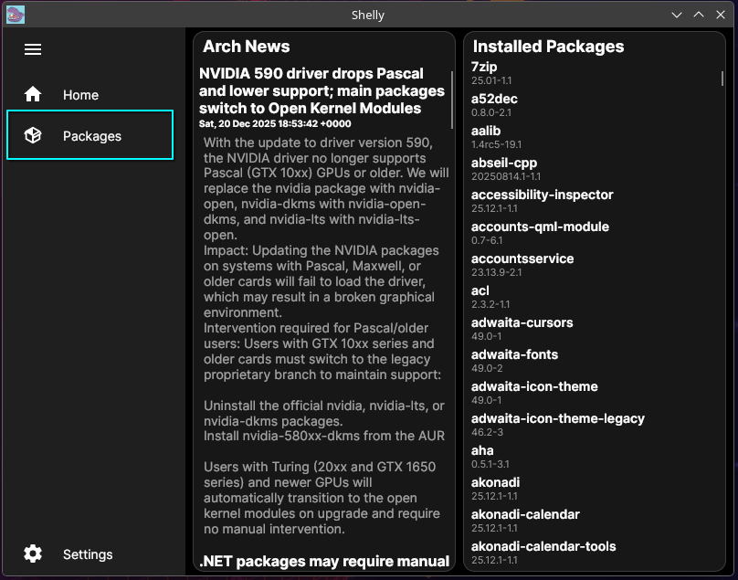
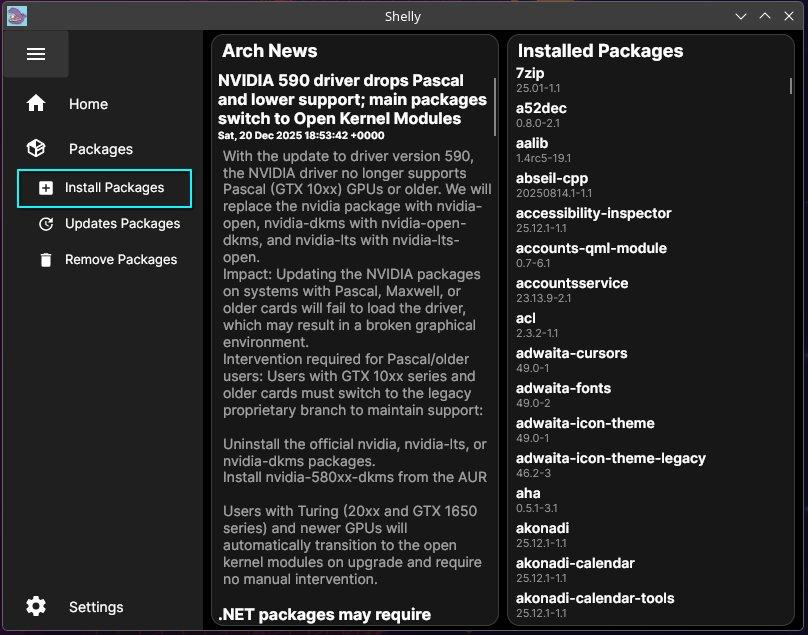
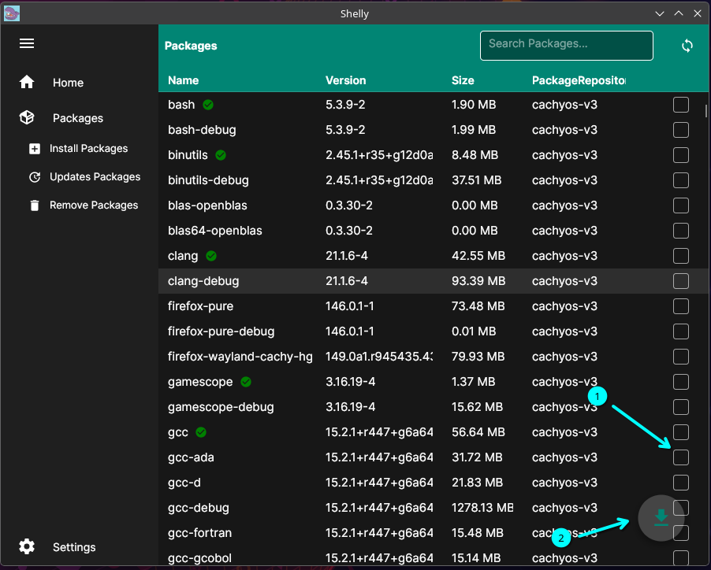
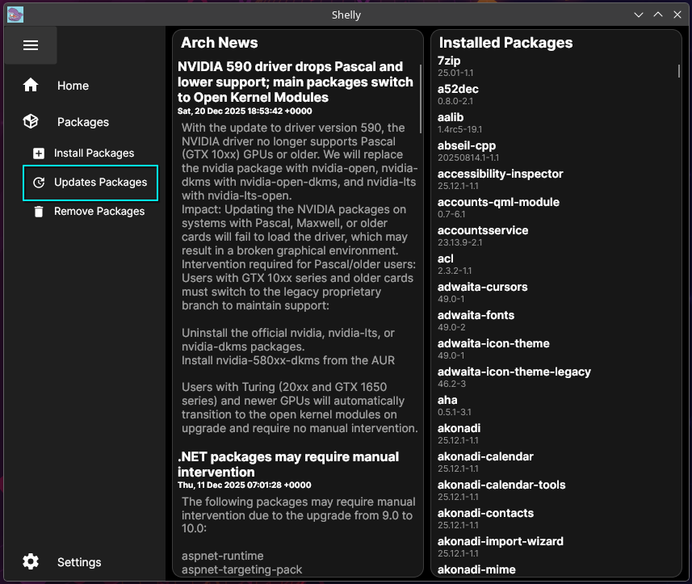
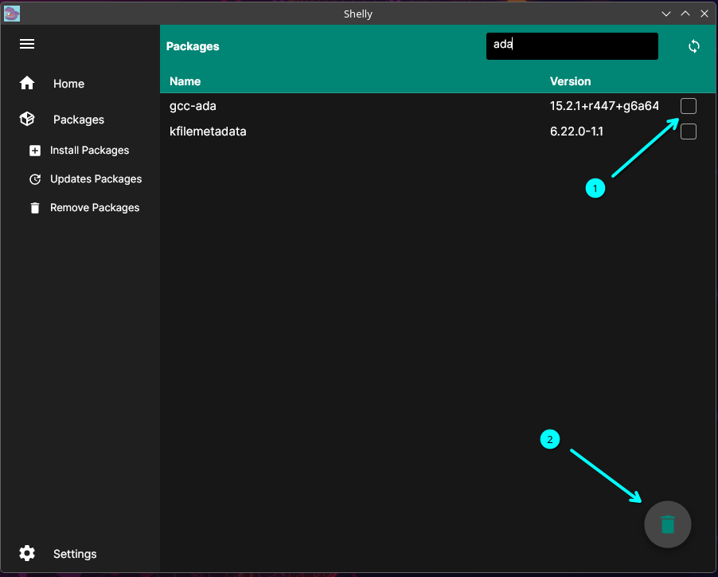
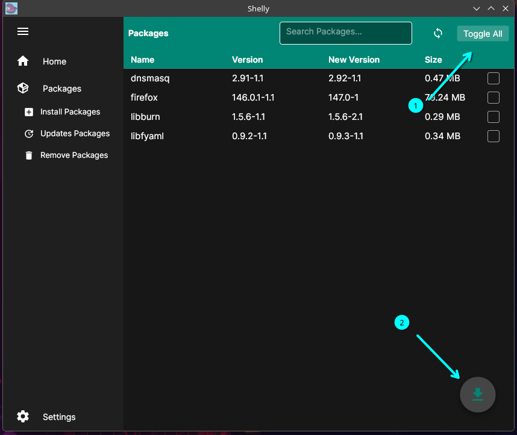
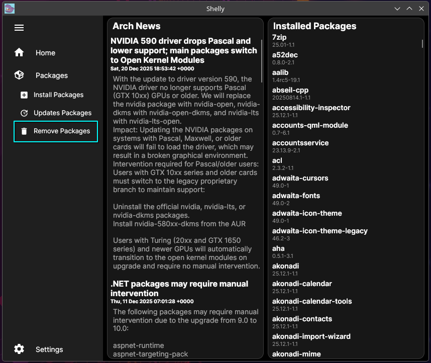
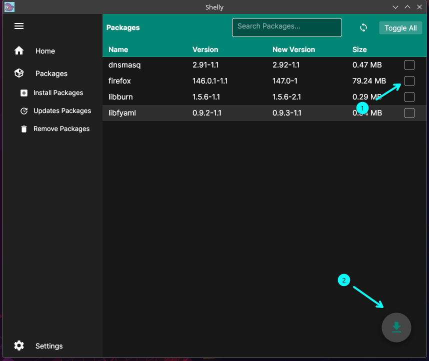

How to install Shelly!

Open the downloaded .tar.gz open in it in terminal by navigating to its download location or opening in a file explorer and opeing in your terminal of choice.

Run the following commands:

chmod +x install.sh

sudo bash install.sh 

Shelly should now be installed to your system and you will be able to search it as any other program.

How to use to use Shelly!

Shelly is a visual package manager meant to make installing, updating, and removing packages simple. 

What is the home page?

The home page includes some key information, such as the Arch news this is important to take a look at to see if any special actions might be needed before updating. We only display the 10 most recent pieces of news but if you ever need more or more detail please check out https://archlinux.org/news/

How to install packages:

To install a package you will click on the package icon this will drop down the menu and you can click on Install Packages

From here you can search for any packages and install them by clicking on the checkbox and the download arrow on the bottom right

How to update packages:

Click on the update package to pull up the update page

There are 2 ways to update packages either by selecting the exact packages you want to update or updating all.

Updating only selected packages, you check the box for the packages you want to select and click the update arrow at the bottom right

Updating all can be handled by selecting Toggle all which will check all box and then hitting the update arrow in the bottom right.

How to remove packages:

lick on the update package to pull up the remove page

To remove a package search for the packages you want to remove and select the package(s) multiple can be selected at one time. Then once you have selected all packages you can remove them by clicking the trashcan icon in the bottom right.

